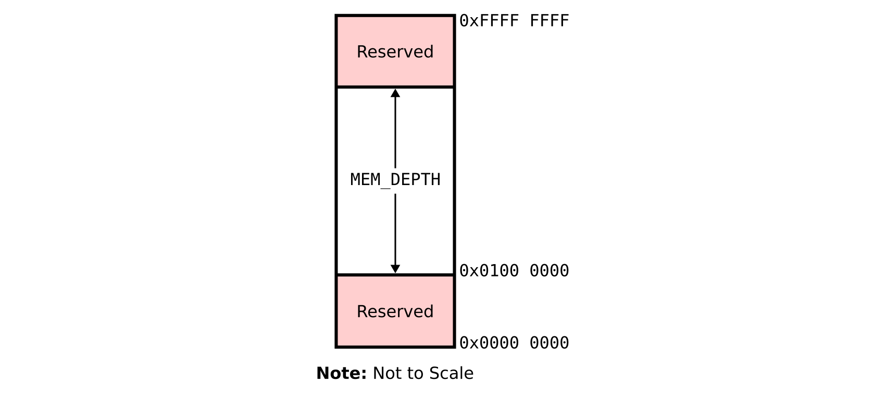

# PD1: Implementing Instruction Memory

This document guides you through the key steps to create your own instruction memory model.

**Deadline**: Friday, September 19, 2025 at 11:59 PM

**Weight**: 5% of total lab grade

## Environment Setup

### Getting the repository

Use `git` to clone the repository to your Linux environment. This can be done using:

```bash
git clone ist-git@git.uwaterloo.ca:ece320-f25/project/g33sun-pd1.git
```

### Setup of simulators and environment variables

Before beginning, ensure that your terminal is using the `bash` shell.
If you run `echo $SHELL`, it should return `/bin/bash` or similar.
If it returns a different shell (e.g. `zsh` or `tcsh`), run the following command:

```bash
chsh -s /bin/bash
```

Log out and log back in and your `echo $SHELL` should now return `/bin/bash`.

Next, go to the root of the project repository and execute the command `source env.sh`.
You should get an output similar to the following.

```bash
$ source env.sh
================ Computer Architecture Course Environment Setup ================

Project Root ($PROJECT_ROOT):           /home/your/path/to/repo
verilator Version ($VERILATOR_VERSION): Verilator 4.210 2021-07-07 rev v4.210
Vivado Version ($VIVADO_VERSION):       Vivado v2022.1 (64-bit)

================ Computer Architecture Course Environment Done =================
```

Note that you will need to run `source env.sh` *every time* you use a different `bash` session.
Otherwise, the scripts will not be able to locate the files.
If the script is unable to locate the verilator or vivado version, the corresponding line will be empty.

## Memory Module Specification

In this PD, you will create a behavioural main memory module that is byte-addressable.
That is, the memory should support addressing individual bytes (8 bits).
We model this module at the behavioural level, meaning that it does not have to be synthesizable.

The memory will have the following ports:

  - `clock` (1 bit)
  - `address` (32 bits)
  - `data_in` (32 bits): The data to be written into the memory at the provided address.
  - `data_out` (32 bits): The data response from the main memory to the address provided.
  - `read_write` (1 bit): Whether the memory is being read from or written to, use 0 to denote a read and 1 to denote a write.

A 32-bit address gives us potential access to $2^{32}$ bytes, or 4 GiB, of memory.
However, we only use a subset of this address space, as shown in the diagram below:



Notice that the address space subset we use starts at address `0x01000000` and has a size of `MEM_DEPTH` bytes.
We provide you with a macro, `MEM_DEPTH`, which defines the size of the memory module in bytes.
You can use this macro when you instantiate the memory array; to use a macro in Verilog, use the backtick character (e.g. `` `MEM_DEPTH ``).
If you inspect any one of the `*.d` files in the [RISC-V benchmarks](https://git.uwaterloo.ca/ece320-f25/rv32-benchmarks), you will notice that all programs start at address `0x01000000`.
For the project, we will treat this as the starting address of the memory, initialize the program counter (PC) to this value, and start fetching instructions from this PC.

Whenever a 32-bit address is supplied on the address line, the memory module should return 32 bits (four bytes) of data on `data_out` using **little-endian** ordering.
For example, if the input address is `0x01000000`, you should return the bytes at addresses `0x01000000` through `0x01000003`.
If the `read_write` input signal asserted, this indicates that the 32-bit value on `data_in` should be written to the memory at the specified `address`.
The main memory should have combinational reads and sequential writes.
This means that on a read operation, the output on `data_out` has the value at the specified `address` in the same clock cycle.
On a write operation, the new value is only available to be read in the next clock cycle.

## Loading a Benchmark File

We will be using the [rv32-benchmarks](https://git.uwaterloo.ca/ece320-f25/rv32-benchmarks) to test your design.
To test your core as you work through the project, you will use the `*.x` files in the benchmark suite.
We provide a macro, `MEM_PATH`, which points to the `*.x` file.
You can override the default value of this macro to supply different `*.x` file paths when running the `make` command (more information [here](#tests)).

Reading the contents of the file into your memory module can be tricky.
You will need to read the `*.x` file using ``$readmemh(`MEM_PATH, arr)`` in an `initial` block, where `arr` is a Verilog array.
What makes this process tricky is that `$readmemh()` will read the data in 32-bit blocks into the array.
Since we are trying to implement a byte-addressable memory where each element is 8 bits (one byte), this causes problems when used directly with `$readmemh()`.
What you will find is that `$readmemh()` will simply truncate the 32-bit data before writing it to the memory.
To get around this, we recommend instantiating a temporary array which can be used with `$readmemh()` to capture *all* data from the source file without truncation.
We provide a macro, `LINE_COUNT`, to identify the number of lines within the `.x` file given by `MEM_PATH`.
You can use this macro to instantiate your temporary array to an appropriate size.
Next, we can copy each byte from this temporary array into the main memory array, within the `initial` block.
This approach allows us to capture the entire benchmark without any lost data while still making sure it is byte-addressable.

## PD Module

You will need to implement some fetch stage logic in the `pd` module in `design/code/pd.v`.
You need to drive the PC using sequential logic.
The PC must be reset to the starting address (`0x01000000`) and increment by four each clock cycle.
You will also need to instantiate the `imemory` module here.

## Probes

As with PD0, you need to fill in `design/signals.h` with your signal names in `design/code/pd.v` to wire up the probes:

```verilog
`define F_PC                ???
`define F_INSN              ???
```

- `F_PC` is the 32-bit `address` input port, which acts as the PC for the fetch stage.
- `F_INSN` is the 32-bit `data_out` output port, which acts as the instruction for the fetch stage.

## Tests

We provide simple tests that test for signal presence and basic timing correctness.

- `test_pd`: Tests for basic signal presence and to generate trace files (see below).  Note that `test_pd` does not check correctness properties, so it does not output `Test passed` even if it successfully completes.
- `test_pre_check`: Tests the initialization properties of your `imemory`
- `test_imemory`: Tests some simple correctness properties of your memory module.

To run these tests, go to `verif/scripts` and use the following command:

```bash
make -s run [TEST=<test_name>] [MEM_PATH=<mem_path>]
```

If you do not supply a `TEST`, the command will default to the `test_pd` test.

We will be using these trace files throughout the project to output signal values at each pipeline stage every clock cycle.
For PD1, we will output information from the fetch stage only.
If it doesn't encounter any errors, the `test_pd` test will generate a `.trace` file for a given benchmark located in `verif/sim/verilator/test_pd/`.
This file will consist of lines formatted as `[F] pc_address content` in hexadecimal format.
For example, the first line of output of `verif/sim/verilator/test_pd/rv32ui-p-addi.trace` should be `[F] 01000000 00000093`.

For PD1, we provide you with the first 400 lines of the golden trace files for the individual instruction benchmarks in `verif/golden`.
Make sure that your output lines up with these.

## Testbench

Apart from the tests we provided, you may write your own testbenches.
This is not required, but may help you find new bugs that the other tests cannot find.

You need to place your testbench in a module called `top`, located in `verif/tests/` (e.g. `verif/tests/test_my_pd.v`).
You may refer to `test_pd.v` and extend from that file.
By creating `test_my_pd.v`, you will be able to run the test in `verif/scripts` using `make run TEST=test_my_pd`.
Make sure that your design does not report any warning during compilation.

We provide the verilator `verif/tests/test_pd.cpp` that drives your testbench. 
However, your testbench should not depend on any modifications to the `test_pd.cpp`.

## Troubleshooting your Design

You may be tempted to rely on `$display()` tasks to debug your design.
However, it can be difficult to determine when signals change value with these statements.
Instead, you can plot the waves using `gtkwave`.
We have provided a Makefile target to do this:

```bash
make waves [MEM_PATH=<mem_path>]
```

You can edit `verif/scripts/waves.tcl` to automatically add specific signals to your screen, group signals together, set colours and zoom level, etc.
If you would like to do this Appendix C in the project deliverables document on LEARN.

## Submission

The following are deliverables for PD1.

1. Write a main memory module behavioural model as described above.
2. Implement the fetch stage in the `design/code/pd.v` module. Instantiate your `imemory` module and drive the program counter.
3. Complete the probe macros in `design/signals.h`. If you added any files, be sure to add them to `verif/scripts/design.f`.
4. Make sure that your design passes `test_imemory`, `test_pd`, and `test_pre_check` without any error or warning.
5. Make sure that your trace files are consistent with those in `verif/golden`.

We will expect that your memory module works with any input benchmark that fits the size specifications.

When you are finished, remember to commit and push your changes to your GitLab repository.
Be sure to execute `git add <PATH(S) TO NEW FILE(S)>` if you add any new files before committing your changes.

```bash
git commit -am "<message>"
git push origin master
```

Your most recently pushed code prior to the deadline will be treated as your submission when we grade.

## Credits


The project structure heavily borrows the AWS EC2 FPGA HDK structure, [see here](https://github.com/aws/aws-fpga).
